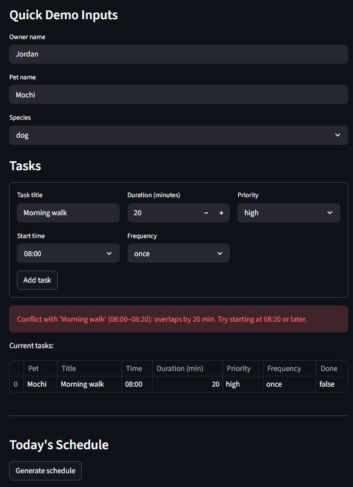

# PawPal+

A Streamlit app that helps pet owners plan and manage daily care tasks across multiple pets — with smart scheduling, conflict detection, and recurring task support.

## Features

- **Sort by time with priority tiebreaking** — Tasks are ordered by start time each day. When two tasks share the same start time, high-priority tasks always appear first.
- **Conflict warnings** — When adding a task, the app detects any time window overlap with existing tasks and shows the exact overlap in minutes plus the earliest available start time.
- **Daily and weekly recurrence** — Tasks marked `daily` are automatically carried forward each day. Tasks marked `weekly` are added only on the matching day of the week. Completed past tasks are reset to incomplete when carried forward.
- **Filter by pet and status** — View tasks for a specific pet by name (case-insensitive), or filter by `completed` / `incomplete` status. Both filters compose together.
- **Multi-pet support** — An owner can manage any number of pets, each with their own independent task list. The schedule view aggregates across all pets.

## Demo



## Scenario

A busy pet owner needs help staying consistent with pet care. They want an assistant that can:

- Track pet care tasks (walks, feeding, meds, enrichment, grooming, etc.)
- Consider constraints (time available, priority, owner preferences)
- Produce a daily plan and explain why it chose that plan

Your job is to design the system first (UML), then implement the logic in Python, then connect it to the Streamlit UI.

## What you will build

Your final app should:

- Let a user enter basic owner + pet info
- Let a user add/edit tasks (duration + priority at minimum)
- Generate a daily schedule/plan based on constraints and priorities
- Display the plan clearly (and ideally explain the reasoning)
- Include tests for the most important scheduling behaviors

## Getting started

### Setup

```bash
python -m venv .venv
source .venv/bin/activate  # Windows: .venv\Scripts\activate
pip install -r requirements.txt
```

### Suggested workflow

1. Read the scenario carefully and identify requirements and edge cases.
2. Draft a UML diagram (classes, attributes, methods, relationships).
3. Convert UML into Python class stubs (no logic yet).
4. Implement scheduling logic in small increments.
5. Add tests to verify key behaviors.
6. Connect your logic to the Streamlit UI in `app.py`.
7. Refine UML so it matches what you actually built.

## Smarter Scheduling

PawPal+ goes beyond a simple task list with four scheduling features built into `Scheduler`:

**Sorting by time with priority tiebreaking** — `sort_by_time()` orders today's tasks ascending by start time. When two tasks share the same start time, `high` priority tasks surface first, followed by `medium`, then `low`. This ensures the most important work is never buried behind a lower-stakes task that happens to start at the same minute.

**Filtering by pet name and completion status** — `filter_tasks(pet_name, status)` narrows today's task list to a specific pet (by name) and/or a completion state (`"completed"` or `"incomplete"`). Both parameters are optional and compose together, so an owner can ask for just Mochi's incomplete tasks in a single call.

**Conflict detection** — `detect_conflicts()` scans today's tasks and returns every pair whose time windows overlap. The Streamlit UI runs this check before adding a new task and surfaces a warning with the conflicting task names and times, preventing double-booking before it reaches the schedule.

**Recurring daily and weekly tasks** — `handle_recurring_tasks()` inspects each pet's task history and automatically clones any `daily` or `weekly` task into today's schedule if it isn't already there. Daily tasks are carried forward every day; weekly tasks are only added when today matches the original task's day of the week. Tasks already present for today are never duplicated.

## Testing PawPal+

Run the test suite with:

```bash
py -m pytest
```

The tests cover:

- Task completion (mark_complete changes status)
- Task addition (adding a task increases pet's task count)
- Sorting with priority tiebreaking (high priority appears first on same start time)
- Recurring weekly tasks (wrong day tasks are not carried forward)
- Conflict detection (fully contained tasks are flagged)
- Filtering by pet name (case-insensitive matching)

Confidence level: 4/5 stars — core behaviors are well covered. Edge cases around weekly recurrence on exact weekday boundaries and three-way conflict detection would be next to add.
